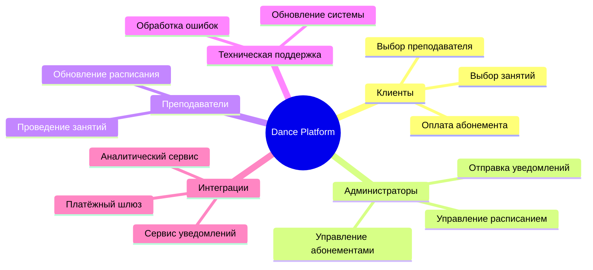
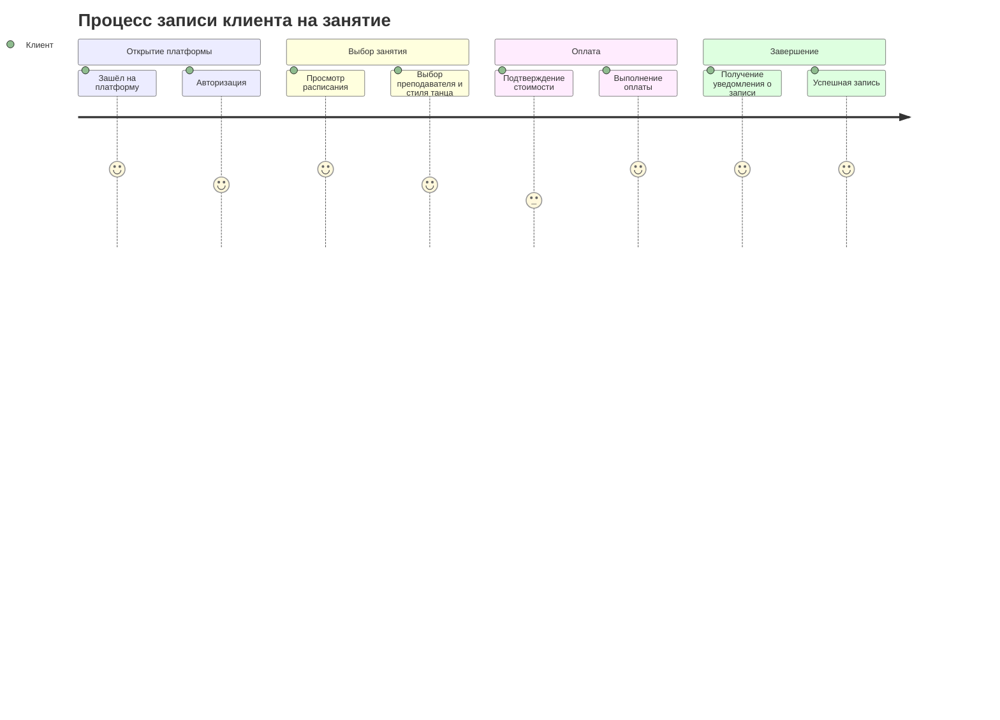
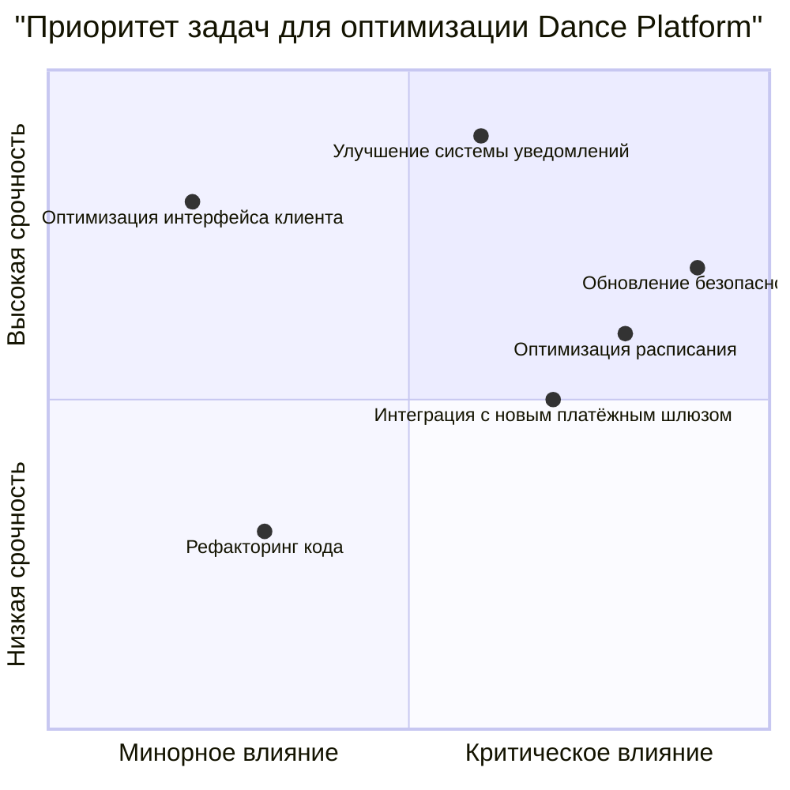
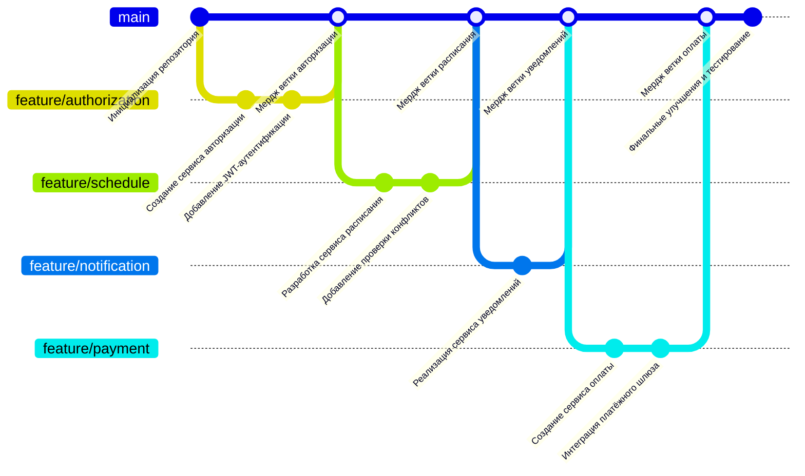

# Dance Platform

Этот проект представляет собой клиент-серверную систему для управления танцевальной студией. Платформа поддерживает взаимодействие между клиентами, администраторами, преподавателями и внешними сервисами.

## Структура функциональных возможностей

### Пояснение диаграммы
1. **Клиенты**: Могут выбирать занятия и преподавателей, а также оплачивать абонементы через систему.
2. **Администраторы**: Управляют расписанием, абонементами и отправляют уведомления пользователям.
3. **Преподаватели**: Проводят занятия и обновляют информацию в расписании.
4. **Техническая поддержка**: Обеспечивает исправление ошибок в работе системы и её обновление.
5. **Интеграции**: Включают платёжный шлюз для обработки транзакций, сервис уведомлений для связи с пользователями и аналитический сервис для анализа данных.

Эта диаграмма позволяет структурировать ключевые аспекты платформы и облегчает понимание её функциональности.

## Диаграмма путешествия пользователя

### Пояснение диаграммы
1. **Открытие платформы**: Клиент заходит на платформу и авторизуется для доступа к её функционалу. Этап вызывает положительные эмоции благодаря удобству интерфейса.
2. **Выбор занятия**: Клиент просматривает расписание, выбирая преподавателя и подходящий стиль танца. Процесс доставляет удовольствие, так как платформа предоставляет удобный и наглядный интерфейс.
3. **Оплата занятия**: После выбора занятия клиент переходит к оплате. Несмотря на возможные сомнения перед оплатой, этот шаг завершается успешно, вызывая удовлетворение.
4. **Подтверждение записи**: Клиент получает уведомление о записи, убеждается в её успешности и остаётся довольным удобством системы.

Диаграмма путешествия пользователя визуализирует процесс взаимодействия клиента с платформой, помогая понять ключевые этапы и эмоциональное состояние пользователя на каждом из них. Это позволяет улучшать пользовательский опыт, выявляя проблемные зоны и усиливая положительные аспекты.

## Диаграмма квадрант-графа

### Пояснение диаграммы
1. **"Оптимизация интерфейса клиента"**: Имеет минорное влияние на систему в целом, но требует высокой срочности для улучшения пользовательского опыта.
2. **"Улучшение системы уведомлений"**: Задача с высоким приоритетом, поскольку она критически влияет на взаимодействие с пользователями и требует немедленного внимания.
3. **"Оптимизация расписания"**: Важна для системного улучшения и эффективного управления данными, но имеет умеренную срочность.
4. **"Обновление безопасности"**: Критически важная задача, которая должна быть выполнена с высоким приоритетом для защиты данных и предотвращения угроз.
5. **"Рефакторинг кода"**: Требует меньшей срочности и имеет относительно низкое влияние на текущую функциональность системы.
6. **"Интеграция с новым платёжным шлюзом"**: Умеренно влияет на систему и требует среднего уровня срочности для повышения удобства оплаты.

Диаграмма квадрант-графа позволяет расставить приоритеты для задач оптимизации и сосредоточиться на тех, которые оказывают максимальное влияние на систему и требуют немедленного выполнения. Код диаграммы представлен в листинге, а результат визуализации — на рисунке.

## Диаграмма гит графа

### Пояснение диаграммы
1. **Основная ветка (`main`)**: Включает все основные изменения системы после их тестирования и слияния.
2. **Ветка `feature/authorization`**: Содержит изменения, связанные с реализацией сервиса авторизации и добавлением JWT-аутентификации.
3. **Ветка `feature/schedule`**: Содержит разработку сервиса расписания и проверку конфликтов для предотвращения ошибок в данных.
4. **Ветка `feature/notification`**: Реализует сервис уведомлений для связи с пользователями.
5. **Ветка `feature/payment`**: Включает изменения для создания сервиса оплаты и интеграции с платёжным шлюзом.

Диаграмма гит графа отображает процесс разработки системы, начиная с инициализации репозитория и заканчивая финальными улучшениями. Код диаграммы представлен в листинге, а её результат позволяет наглядно увидеть историю ветвления и слияния в проекте. 
